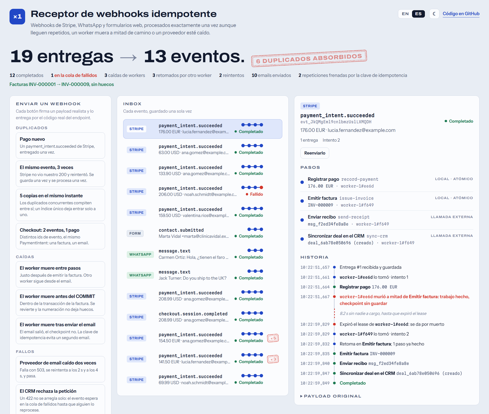
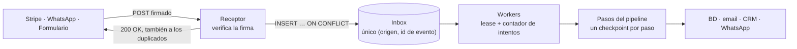
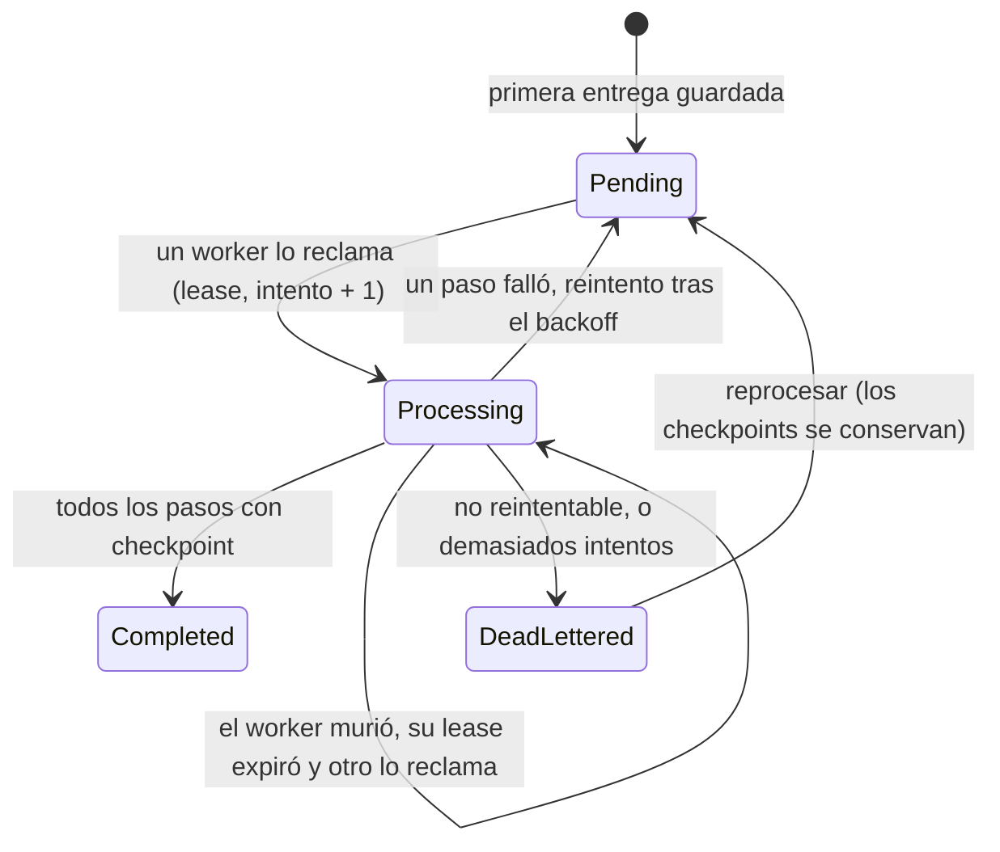

# Receptor de webhooks idempotente

[](https://github.com/MateoVH/WebhookDemo/actions/workflows/ci.yml)


[English](README.md) · **Español**

Recibe webhooks de **Stripe**, **WhatsApp** y **formularios web**, y procesa cada evento **exactamente una vez**: aunque el proveedor lo entregue dos veces, aunque un worker muera a mitad de camino y aunque una API externa esté caída.



El dashboard viene con el proyecto. Cada botón envía un webhook real y firmado por el mismo código que `POST /webhooks/{source}`, y muestra qué le pasó: los duplicados absorbidos, los workers que se cayeron y el que tomó el relevo, los reintentos y la numeración de facturas sin huecos.

## El problema

Los proveedores de webhooks entregan **al menos una vez**. Stripe reintenta durante hasta tres días hasta recibir un 2xx, y Meta hace lo mismo con WhatsApp. En producción eso significa:

- **El mismo evento, dos veces.** Tu 200 se perdió y Stripe vuelve a enviarlo. Sin protección: dos facturas, dos emails.
- **Una caída a mitad de camino.** El pago quedó guardado pero la factura no. El reintento vuelve a registrar el pago o se salta la factura.
- **Una API externa caída.** El CRM responde 503. Si no reintentas, pierdes el evento; si reintentas todo, repites los pasos que ya habían funcionado.
- **Dos eventos distintos sobre lo mismo.** Stripe Checkout envía `checkout.session.completed` *y* `payment_intent.succeeded` para un solo pago. Deduplicar por id de evento no lo detecta.

## Cómo funciona



1. **Recibir, guardar una vez y responder rápido.** El receptor verifica la firma, guarda el evento con un único `INSERT … ON CONFLICT DO UPDATE … RETURNING` atómico y responde 200 enseguida, también a los duplicados, para que el proveedor deje de reintentar. No existe una ventana de "comprobar y luego insertar" por la que puedan colarse dos entregas simultáneas. Nada se procesa dentro de la petición, así que un CRM lento no puede hacer que el proveedor agote su tiempo de espera y reintente.
2. **Procesar paso a paso, con checkpoints.** Un pago son cuatro pasos: `record-payment → issue-invoice → send-receipt → sync-crm`. Cada paso terminado deja un checkpoint. Cualquier intento posterior empieza en el primer paso que no tenga uno.
3. **Leases en lugar de bloqueos.** Un worker reclama un evento con un `UPDATE` condicional que fija `LockedBy` y `LockedUntil`; mientras trabaja no se mantiene ningún bloqueo en la base de datos. Si el worker muere, su lease expira y otro worker continúa. Cada escritura vuelve a comprobar el lease, así que un worker que se quedó congelado y lo perdió no puede pisar al que tomó el relevo: su transacción se revierte.
4. **Reintentar lo recuperable y apartar lo que no.** Los fallos transitorios se reintentan con backoff exponencial y jitter (2 s, 4 s, 8 s, 16 s…, con un tope de 5 min). Tras `MaxAttempts`, o de inmediato si reintentar no lo va a arreglar (un payload mal formado, un HTTP 422), el evento pasa a la cola de fallidos (dead-letter queue). Al reprocesarlo, sigue desde el paso que falló.



### Tres capas de idempotencia

| Capa | Evita | Cómo |
|---|---|---|
| Entrega | que el mismo evento se guarde o procese dos veces | `UNIQUE (Source, ExternalId)` y un único upsert atómico ([`InboxWriter`](src/WebhookDemo.Api/Inbox/InboxWriter.cs)) |
| Paso | que un paso ya terminado se repita tras una caída o un reintento | un checkpoint por (evento, paso), confirmado junto con las escrituras del propio paso ([`InboxProcessor`](src/WebhookDemo.Api/Inbox/InboxProcessor.cs)) |
| Negocio | que dos eventos *distintos* produzcan el mismo efecto | efectos indexados por ids de negocio: el PaymentIntent, el envío del formulario, el mensaje ([`StripePaymentPipeline`](src/WebhookDemo.Api/Pipelines/Payments/StripePaymentPipeline.cs)) |

### Cada paso es idempotente de una de tres formas

| Paso | Tipo | Por qué ejecutarlo dos veces no hace daño |
|---|---|---|
| `record-payment`, `issue-invoice` | local | Las escrituras del paso, su checkpoint y la renovación del lease se confirman en **una sola transacción**. Si el worker muere antes del COMMIT, la base de datos lo deshace todo. |
| `send-receipt` | externo | La misma **clave de idempotencia** en cada intento (`receipt:{paymentIntentId}`), así que el proveedor de email lo envía una vez. |
| `sync-crm` | externo | Un **upsert** por el id del pago: una segunda ejecución actualiza el mismo deal en lugar de crear otro. |

Nunca se mantiene una transacción abierta durante una llamada de red: los pasos externos se ejecutan fuera de ella, y justo por eso necesitan su propia idempotencia.

### Numeración de facturas sin huecos

Los números de factura deben ser consecutivos, sin huecos ni repetidos, como exigen las autoridades fiscales de muchos países. El número se calcula como `MAX + 1` dentro de la misma transacción que inserta la factura y su checkpoint, con un índice único como red de seguridad. Una caída antes del COMMIT no consume ningún número. Las secuencias de la base de datos no pueden garantizar esto: en la demo, los ids del inbox saltan cuando llegan duplicados (cada inserción rechazada consume uno). Para un id no importa; para una factura es inaceptable.

### Qué significa de verdad "exactamente una vez"

La entrega *exactamente una vez* no existe a través de una red. Lo que sí se puede construir son efectos exactamente una vez: entrega al menos una vez más un procesamiento idempotente.

- Los efectos sobre nuestra propia base de datos ocurren exactamente una vez, gracias a las transacciones.
- Los efectos externos ocurren exactamente una vez solo si el otro lado puede deduplicar, con una clave de idempotencia o un upsert.
- La API de WhatsApp Cloud no ofrece ninguna de las dos para los mensajes salientes, así que la **respuesta automática de WhatsApp es al menos una vez**: si el worker muere justo entre enviarla y guardar el checkpoint, el cliente la recibe dos veces. Una prueba deja fijado ese comportamiento ([`WhatsApp_auto_reply_is_at_least_once_because_the_API_has_no_idempotency_key`](tests/WebhookDemo.Tests/CrashRecoveryTests.cs)) para que nadie lo olvide. Aquí es aceptable solo porque un "recibimos tu mensaje" repetido no hace daño.
- El 200 se envía solo después de que el evento quede confirmado en el inbox. Si la base de datos está caída, el endpoint falla, el proveedor reintenta más tarde y no se pierde nada.

## Pruebas: duplicados, caídas y reintentos

49 pruebas que se ejecutan contra la app real (`WebApplicationFactory` de ASP.NET Core, un archivo SQLite desechable por prueba) con un reloj simulado, de modo que los leases y el backoff se prueban sin esperas. Los workers se mueven a mano, así que cada caída es determinista.

| Pruebas | Qué demuestran |
|---|---|
| [`DuplicateDeliveryTests`](tests/WebhookDemo.Tests/DuplicateDeliveryTests.cs) | 3 entregas → se guarda una vez y se procesa una vez · un duplicado que llega una hora después se ignora · **20 entregas simultáneas → exactamente una fila** · `checkout.session.completed` + `payment_intent.succeeded` → una factura, un email · los lotes de WhatsApp se separan y cada mensaje se deduplica · los reenvíos de formularios se ignoran · los tipos de evento desconocidos se guardan pero no se procesan |
| [`CrashRecoveryTests`](tests/WebhookDemo.Tests/CrashRecoveryTests.cs) | un worker que muere después de cada uno de los 4 pasos es reemplazado y nada se repite · **morir dentro de la transacción de la factura no deja huecos** · morir justo después de llamar al proveedor de email no lo envía dos veces · un worker que perdió su lease no puede guardar su trabajo · un evento que tumba a cada worker termina en la cola de fallidos |
| [`RetryTests`](tests/WebhookDemo.Tests/RetryTests.cs) | backoff 2 s → 4 s → éxito, sin repetir los pasos anteriores · los fallos interminables van a la cola de fallidos tras 5 intentos · un 422 va a la cola de fallidos de inmediato · reprocesar sigue desde el paso que falló · los payloads imposibles de procesar no se reintentan |
| [`SignatureTests`](tests/WebhookDemo.Tests/SignatureTests.cs) | se rechazan firmas ausentes, con otro secreto, de cuerpos alterados y **de hace 6 minutos (reenviadas por un atacante)** · rotación de secretos · **compatible con la librería oficial Stripe.net** · verificación de suscripción de WhatsApp · formularios · 404 / 413 / 400 |
| [`ConcurrencyTests`](tests/WebhookDemo.Tests/ConcurrencyTests.cs) | 8 workers en paralelo sobre 200 eventos: cada uno se reclama una vez, facturas 1–200 |
| [`ChaosStormTests`](tests/WebhookDemo.Tests/ChaosStormTests.cs) | todo a la vez, ver abajo |
| [`DemoScenarioTests`](tests/WebhookDemo.Tests/DemoScenarioTests.cs), [`BackoffTests`](tests/WebhookDemo.Tests/BackoffTests.cs) | cada botón del dashboard termina donde promete · el cálculo del backoff |

**La tormenta.** 4.409 pagos; uno de cada cinco llega anunciado por dos eventos distintos de Stripe, y cada evento se entrega de una a tres veces, en orden aleatorio y de dieciséis en dieciséis. Cuatro workers los procesan mientras un chaos monkey tumba a un worker en el 2 % de los puntos críticos y hace fallar a los proveedores en el 3 % de los pasos. Una ejecución típica:

```text
4,409 payments → 5,273 distinct events → 10,528 deliveries (5,255 duplicates absorbed)
Chaos: 1,307 worker crashes, 646 provider failures
Result: 4,409 invoices (INV-000001 … INV-004409, no gaps, no repeats), 4,409 emails sent out of 5,367 requests, 4,409 CRM deals
```

Es decir: 4.409 pagos, 10.528 entregas, 5.255 duplicados absorbidos, 1.307 caídas de workers y 646 fallos de proveedores, y aun así exactamente 4.409 facturas consecutivas, 4.409 emails y 4.409 deals en el CRM.

## Ejecutarlo

Solo necesitas el [SDK de .NET 10](https://dotnet.microsoft.com/download). Sin servidor de base de datos, sin Docker y sin cuentas: el archivo SQLite se crea en el primer arranque.

```bash
git clone https://github.com/MateoVH/WebhookDemo.git
cd WebhookDemo
dotnet run --project src/WebhookDemo.Api
```

Abre <http://localhost:5080>, cambia entre inglés y español arriba y pulsa los botones.

```bash
dotnet test
```

### Enviar un webhook firmado desde la terminal

Los scripts firman el payload exactamente como lo hace Stripe:

```bash
bash scripts/send-stripe-event.sh 3
```

```powershell
./scripts/send-stripe-event.ps1 -Times 3
```

La primera entrega vuelve como `accepted`; las dos siguientes, como `duplicate`, también con un 200.

### Con la CLI real de Stripe

La verificación de firma sigue el esquema de Stripe y está probada contra la librería oficial Stripe.net, así que puedes apuntarle la CLI de Stripe:

```bash
stripe listen --forward-to localhost:5080/webhooks/stripe
# en otra terminal, con el secreto whsec_… que imprimió `stripe listen`
Webhooks__Stripe__SigningSecret=whsec_... dotnet run --project src/WebhookDemo.Api
stripe trigger payment_intent.succeeded
```

En PowerShell, el secreto se define con `$env:Webhooks__Stripe__SigningSecret = "whsec_..."`. `stripe trigger` también envía eventos como `charge.succeeded`: se guardan y se marcan como *ignorados*, que es lo que debe hacer un receptor con los tipos de evento que no maneja.

## Endpoints

| Método | Ruta | |
|---|---|---|
| POST | `/webhooks/stripe` | Eventos de Stripe, firmados con `Stripe-Signature` |
| POST | `/webhooks/whatsapp` | WhatsApp Cloud API, firmado con `X-Hub-Signature-256`; los lotes se separan por mensaje |
| GET | `/webhooks/whatsapp` | Verificación de suscripción de Meta (`hub.verify_token`, `hub.challenge`) |
| POST | `/webhooks/forms` | Envíos de formularios, firmados con `X-Signature-256`, con `submissionId` dentro del cuerpo firmado |
| GET | `/api/overview`, `/api/events/{id}` | Lo que muestra el dashboard |
| POST | `/api/events/{id}/replay` | Reprocesar un evento de la cola de fallidos |
| POST | `/demo/scenarios/{name}`, `/demo/events/{id}/redeliver`, `/demo/reset` | Solo en modo demo |
| GET | `/health` | Health check |

## Configuración

| Ajuste | Por defecto | |
|---|---|---|
| `Webhooks:Stripe:SigningSecret` | — | El secreto `whsec_…` del dashboard de Stripe o de `stripe listen` |
| `Webhooks:Stripe:Tolerance` | `00:05:00` | Antigüedad máxima de una petición firmada |
| `Webhooks:WhatsApp:AppSecret`, `VerifyToken` | — | El app secret de Meta, y el token que escribes al registrar la URL |
| `Webhooks:Forms:SigningSecret` | — | El secreto compartido con la herramienta de formularios |
| `Processing:Workers` | `2` | Workers por proceso; para más, ejecuta varios procesos |
| `Processing:LeaseDuration` | `00:00:30` (8 s en Development) | Cuánto tiempo pasa hasta dar por muerto a un worker que no responde |
| `Processing:MaxAttempts` | `5` | Antes de la cola de fallidos |
| `Processing:RetryBaseDelay`, `RetryMaxDelay` | `00:00:02`, `00:05:00` | Rango del backoff |
| `Demo:Enabled` | `false` (`true` en Development) | Botones de escenarios e inyección de fallos |

Los secretos de `appsettings.Development.json` son solo para uso local. Para los reales, usa user-secrets o variables de entorno.

## Estructura del proyecto

```text
src/WebhookDemo.Api
├── Webhooks/      Recepción: verificación de firma por proveedor y separación de entregas en eventos
├── Inbox/         El motor: inbox deduplicado, leases, ejecución por pasos con checkpoints, reintentos, workers
├── Pipelines/     Flujos de negocio: pago de Stripe → factura, formulario → lead, WhatsApp → respuesta automática
├── Integrations/  Proveedores salientes (email, CRM, WhatsApp), simulados para que todo funcione sin conexión
├── Dashboard/     La API de lectura que usa el dashboard
├── Demo/          Botones de escenarios e inyección de fallos, apagados fuera de Development
└── wwwroot/       El dashboard: HTML, CSS y JavaScript sin frameworks, en inglés y español
tests/WebhookDemo.Tests
```

Para una lectura rápida: [`InboxWriter`](src/WebhookDemo.Api/Inbox/InboxWriter.cs) (deduplicación), [`InboxQueue`](src/WebhookDemo.Api/Inbox/InboxQueue.cs) (leases), [`InboxProcessor`](src/WebhookDemo.Api/Inbox/InboxProcessor.cs) (pasos y checkpoints) y [`StripePaymentPipeline`](src/WebhookDemo.Api/Pipelines/Payments/StripePaymentPipeline.cs) (un flujo de negocio completo en una pantalla).

Hecho con .NET 10, minimal APIs de ASP.NET Core, EF Core 10 sobre SQLite y xUnit v3.

## Llevarlo a producción

- **PostgreSQL.** La sentencia de deduplicación funciona sin cambios. Con muchos workers, reclama con `FOR UPDATE SKIP LOCKED` y usa migraciones de EF Core en lugar de `EnsureCreated`.
- **Retención.** Conserva los ids de evento al menos mientras los proveedores reintentan (Stripe: tres días), mejor más; pasado ese tiempo, purga los payloads y las historias de los eventos completados.
- **Seguridad.** Pon `/api` detrás de autenticación, deja `Demo:Enabled` apagado y guarda los secretos en un vault. Los secretos de Stripe se pueden rotar sin cortes: se aceptan varias firmas `v1`.
- **Observabilidad.** Alertas sobre la cola de fallidos, la antigüedad del evento pendiente más viejo y la tasa de reintentos.
- **Orden.** Los proveedores no garantizan el orden (Stripe lo dice explícitamente) y ninguno de estos pipelines depende de él.
- **Publicar eventos.** Para avisar a otros servicios, añade un outbox transaccional: la misma idea, en la otra dirección.

## Licencia

[MIT](LICENSE)
