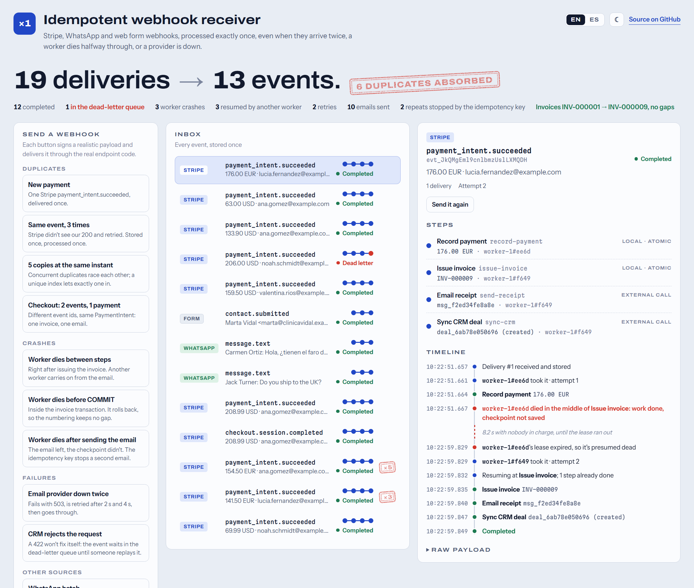
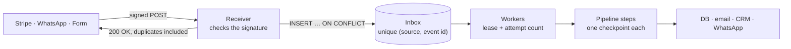
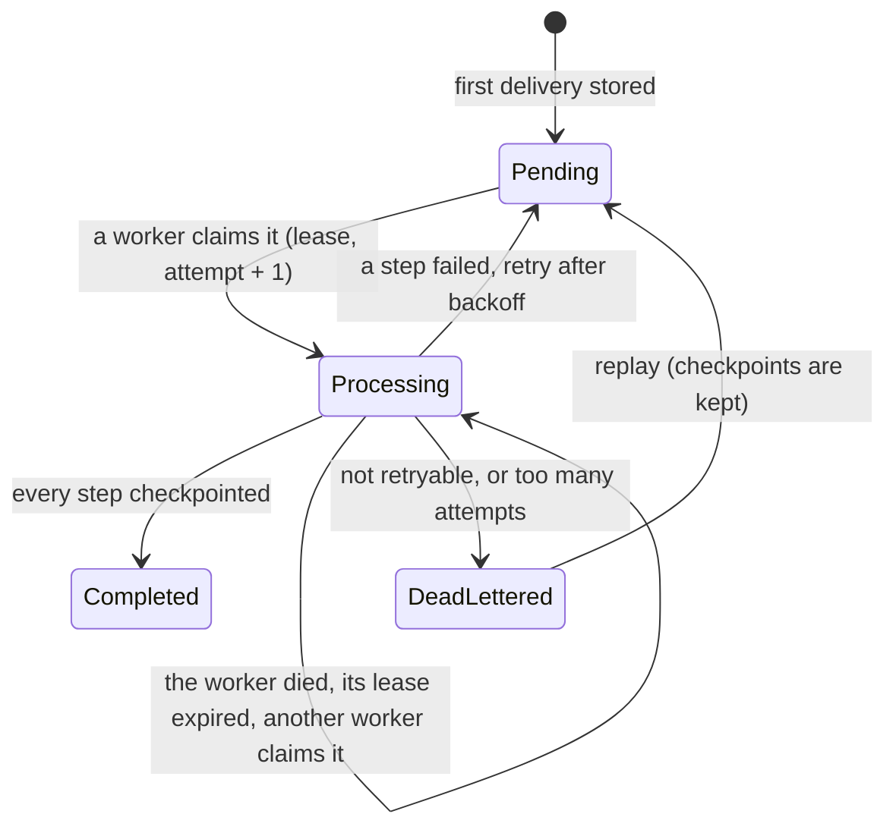

# Idempotent webhook receiver

[](https://github.com/MateoVH/WebhookDemo/actions/workflows/ci.yml)


**English** · [Español](README.es.md)

Receives webhooks from **Stripe**, **WhatsApp** and **web forms**, and processes each event **exactly once**: when the provider delivers it twice, when a worker dies halfway through, and when a downstream API is down.



The dashboard ships with the project. Every button sends a real, signed webhook through the same code as `POST /webhooks/{source}` and shows what happened to it: duplicates absorbed, workers that crashed and the worker that took over, retries, and the invoice numbering staying gapless.

## The problem

Webhook providers deliver **at least once**. Stripe keeps retrying for up to three days until it gets a 2xx, and Meta does the same for WhatsApp. In production that means:

- **The same event, twice.** Your 200 got lost, so Stripe sends the event again. Without protection: two invoices, two emails.
- **A crash halfway through.** The payment is saved but the invoice isn't. The retry either records the payment again or skips the invoice.
- **A downstream API that's down.** The CRM answers 503. Don't retry and the event is lost; retry everything and you repeat the steps that had already worked.
- **Two different events about the same thing.** Stripe Checkout sends `checkout.session.completed` *and* `payment_intent.succeeded` for one payment. Deduplicating by event id doesn't catch that.

## How it works



1. **Receive, store once, answer fast.** The receiver verifies the signature, stores the event with a single atomic `INSERT … ON CONFLICT DO UPDATE … RETURNING`, and answers 200 straight away, duplicates included, so the provider stops retrying. There's no check-then-insert window for two simultaneous deliveries to slip through. Nothing is processed in the request, so a slow CRM can't make the provider time out and retry.
2. **Process step by step, with checkpoints.** A payment is four steps: `record-payment → issue-invoice → send-receipt → sync-crm`. Each finished step leaves a checkpoint. Any later attempt starts at the first step without one.
3. **Leases, not locks.** A worker claims an event with a conditional `UPDATE` that sets `LockedBy` and `LockedUntil`; no database lock is held while it works. If the worker dies, its lease expires and another worker carries on. Every write re-checks the lease, so a worker that stalled and lost it can't overwrite the one that took over: its transaction rolls back.
4. **Retry what can recover, park what can't.** Transient failures are retried with exponential backoff and jitter (2 s, 4 s, 8 s, 16 s…, capped at 5 min). After `MaxAttempts`, or straight away for errors that retrying won't fix (a malformed payload, an HTTP 422), the event goes to the dead-letter queue. Replaying it resumes at the step that failed.



### Three layers of idempotency

| Layer | Stops | How |
|---|---|---|
| Delivery | the same event stored or processed twice | `UNIQUE (Source, ExternalId)` and one atomic upsert ([`InboxWriter`](src/WebhookDemo.Api/Inbox/InboxWriter.cs)) |
| Step | a finished step running again after a crash or a retry | a checkpoint per (event, step), committed with the step's own writes ([`InboxProcessor`](src/WebhookDemo.Api/Inbox/InboxProcessor.cs)) |
| Business | two *different* events having the same effect | effects keyed by business ids: the PaymentIntent, the form submission, the message ([`StripePaymentPipeline`](src/WebhookDemo.Api/Pipelines/Payments/StripePaymentPipeline.cs)) |

### Each step is idempotent in one of three ways

| Step | Kind | Why running it twice is harmless |
|---|---|---|
| `record-payment`, `issue-invoice` | local | The step's writes, its checkpoint and the lease renewal commit in **one transaction**. Die before COMMIT and the database undoes all of it. |
| `send-receipt` | external | The same **idempotency key** on every attempt (`receipt:{paymentIntentId}`), so the email provider sends it once. |
| `sync-crm` | external | An **upsert** keyed by the payment id: a second run updates the same deal instead of creating another. |

No transaction is ever held open across a network call: external steps run outside it, and that's exactly why they need their own idempotency.

### Gapless invoice numbers

Invoice numbers have to be consecutive, with no gaps and no repeats, as tax authorities require in many countries. The number is taken as `MAX + 1` inside the same transaction that inserts the invoice and its checkpoint, with a unique index as the backstop. A crash before COMMIT burns nothing. Database sequences can't promise this: watch the inbox ids in the demo jump when duplicates arrive (every rejected insert consumes one). That's fine for ids, unacceptable for invoices.

### What "exactly once" honestly means

Exactly-once *delivery* doesn't exist over a network. What you can build is exactly-once *effects*: at-least-once delivery plus idempotent processing.

- Effects on our own database are exactly once, thanks to transactions.
- External effects are exactly once only if the other side can deduplicate, with an idempotency key or an upsert.
- The WhatsApp Cloud API has neither for outgoing messages, so the WhatsApp **auto-reply is at-least-once**: if the worker dies in the instant between sending it and saving the checkpoint, the customer gets it twice. A test pins this down ([`WhatsApp_auto_reply_is_at_least_once_because_the_API_has_no_idempotency_key`](tests/WebhookDemo.Tests/CrashRecoveryTests.cs)) so nobody forgets it. It's acceptable here only because a repeated "we got your message" is harmless.
- The 200 is sent only after the event is committed to the inbox. If the database is down the endpoint fails, the provider retries later, and nothing is lost.

## Tests: duplicates, crashes and retries

49 tests run against the real app (ASP.NET Core `WebApplicationFactory`, a throwaway SQLite file per test) with a fake clock, so leases and backoff are tested without sleeping. Workers are driven by hand, which makes every crash deterministic.

| Tests | What they prove |
|---|---|
| [`DuplicateDeliveryTests`](tests/WebhookDemo.Tests/DuplicateDeliveryTests.cs) | 3 deliveries → stored once, processed once · a duplicate arriving an hour later is ignored · **20 simultaneous deliveries → exactly one row** · `checkout.session.completed` + `payment_intent.succeeded` → one invoice, one email · WhatsApp batches are split and each message deduplicated · form resubmissions ignored · unknown event types kept but not processed |
| [`CrashRecoveryTests`](tests/WebhookDemo.Tests/CrashRecoveryTests.cs) | a worker dying after each of the 4 steps is replaced and nothing repeats · **dying inside the invoice transaction leaves no gap** · dying right after the email call doesn't send it twice · a worker that lost its lease can't save its work · an event that keeps killing workers ends up dead-lettered |
| [`RetryTests`](tests/WebhookDemo.Tests/RetryTests.cs) | backoff 2 s → 4 s → success, earlier steps not repeated · endless failures dead-lettered after 5 attempts · a 422 dead-lettered at once · replay resumes at the failed step · unprocessable payloads aren't retried |
| [`SignatureTests`](tests/WebhookDemo.Tests/SignatureTests.cs) | missing, wrong-secret, tampered and **6-minute-old (replayed) signatures rejected** · secret rotation · **compatible with the official Stripe.net library** · WhatsApp handshake · forms · 404 / 413 / 400 |
| [`ConcurrencyTests`](tests/WebhookDemo.Tests/ConcurrencyTests.cs) | 8 workers in parallel over 200 events: each claimed once, invoices 1–200 |
| [`ChaosStormTests`](tests/WebhookDemo.Tests/ChaosStormTests.cs) | everything at once, below |
| [`DemoScenarioTests`](tests/WebhookDemo.Tests/DemoScenarioTests.cs), [`BackoffTests`](tests/WebhookDemo.Tests/BackoffTests.cs) | every dashboard button ends where it promises · the backoff math |

**The storm.** 4,409 payments, one in five announced by two different Stripe events, every event delivered one to three times in random order, sixteen at a time. Four workers process them while a chaos monkey kills a worker at 2 % of the critical points and makes providers fail at 3 % of the steps. A typical run:

```text
4,409 payments → 5,273 distinct events → 10,528 deliveries (5,255 duplicates absorbed)
Chaos: 1,307 worker crashes, 646 provider failures
Result: 4,409 invoices (INV-000001 … INV-004409, no gaps, no repeats), 4,409 emails sent out of 5,367 requests, 4,409 CRM deals
```

## Run it

You only need the [.NET 10 SDK](https://dotnet.microsoft.com/download). No database server, no Docker, no accounts: a SQLite file is created on first run.

```bash
git clone https://github.com/MateoVH/WebhookDemo.git
cd WebhookDemo
dotnet run --project src/WebhookDemo.Api
```

Open <http://localhost:5080>, switch between English and Spanish at the top, and press the buttons.

```bash
dotnet test
```

### Send a signed webhook from the terminal

The scripts sign the payload exactly the way Stripe does:

```bash
bash scripts/send-stripe-event.sh 3
```

```powershell
./scripts/send-stripe-event.ps1 -Times 3
```

The first delivery comes back `accepted`; the next two come back `duplicate`, still with a 200.

### With the real Stripe CLI

The signature check follows Stripe's scheme and is tested against the official Stripe.net library, so you can point the Stripe CLI at it:

```bash
stripe listen --forward-to localhost:5080/webhooks/stripe
# in another terminal, using the whsec_… secret that `stripe listen` printed
Webhooks__Stripe__SigningSecret=whsec_... dotnet run --project src/WebhookDemo.Api
stripe trigger payment_intent.succeeded
```

In PowerShell, set the secret with `$env:Webhooks__Stripe__SigningSecret = "whsec_..."`. `stripe trigger` also sends events such as `charge.succeeded`: they're stored and marked *ignored*, which is what a receiver should do with event types it doesn't handle.

## Endpoints

| Method | Path | |
|---|---|---|
| POST | `/webhooks/stripe` | Stripe events, signed with `Stripe-Signature` |
| POST | `/webhooks/whatsapp` | WhatsApp Cloud API, signed with `X-Hub-Signature-256`; batches are split per message |
| GET | `/webhooks/whatsapp` | Meta's subscription handshake (`hub.verify_token`, `hub.challenge`) |
| POST | `/webhooks/forms` | Form submissions, signed with `X-Signature-256`, `submissionId` inside the signed body |
| GET | `/api/overview`, `/api/events/{id}` | What the dashboard shows |
| POST | `/api/events/{id}/replay` | Replay a dead-lettered event |
| POST | `/demo/scenarios/{name}`, `/demo/events/{id}/redeliver`, `/demo/reset` | Demo mode only |
| GET | `/health` | Health check |

## Configuration

| Setting | Default | |
|---|---|---|
| `Webhooks:Stripe:SigningSecret` | — | The `whsec_…` secret from the Stripe dashboard or `stripe listen` |
| `Webhooks:Stripe:Tolerance` | `00:05:00` | Maximum age of a signed request |
| `Webhooks:WhatsApp:AppSecret`, `VerifyToken` | — | The Meta app secret, and the token you type when registering the URL |
| `Webhooks:Forms:SigningSecret` | — | The secret shared with the form tool |
| `Processing:Workers` | `2` | Worker loops per process; run several processes for more |
| `Processing:LeaseDuration` | `00:00:30` (8 s in Development) | How long until a silent worker is presumed dead |
| `Processing:MaxAttempts` | `5` | Before the dead-letter queue |
| `Processing:RetryBaseDelay`, `RetryMaxDelay` | `00:00:02`, `00:05:00` | Backoff range |
| `Demo:Enabled` | `false` (`true` in Development) | Scenario buttons and fault injection |

The secrets in `appsettings.Development.json` are for local use only. Use user-secrets or environment variables for real ones.

## Project structure

```text
src/WebhookDemo.Api
├── Webhooks/      Receiving: signature checks per provider, splitting deliveries into events
├── Inbox/         The engine: deduplicated inbox, leases, step runner with checkpoints, retries, workers
├── Pipelines/     Business flows: Stripe payment → invoice, form → lead, WhatsApp → auto-reply
├── Integrations/  Outbound providers (email, CRM, WhatsApp), simulated so everything runs offline
├── Dashboard/     The read API behind the dashboard
├── Demo/          Scenario buttons and fault injection, off outside Development
└── wwwroot/       The dashboard: plain HTML, CSS and JavaScript, in English and Spanish
tests/WebhookDemo.Tests
```

For a quick read: [`InboxWriter`](src/WebhookDemo.Api/Inbox/InboxWriter.cs) (deduplication), [`InboxQueue`](src/WebhookDemo.Api/Inbox/InboxQueue.cs) (leases), [`InboxProcessor`](src/WebhookDemo.Api/Inbox/InboxProcessor.cs) (steps and checkpoints) and [`StripePaymentPipeline`](src/WebhookDemo.Api/Pipelines/Payments/StripePaymentPipeline.cs) (a whole business flow on one screen).

Built with .NET 10, ASP.NET Core minimal APIs, EF Core 10 on SQLite, and xUnit v3.

## Taking it to production

- **PostgreSQL.** The deduplication statement works unchanged. With many workers, claim with `FOR UPDATE SKIP LOCKED`, and use EF Core migrations instead of `EnsureCreated`.
- **Retention.** Keep event ids for at least as long as providers retry (Stripe: three days), ideally longer; purge the payloads and timelines of completed events after that.
- **Security.** Put `/api` behind authentication, keep `Demo:Enabled` off, keep secrets in a vault. Stripe secrets can be rolled without downtime: several `v1` signatures are accepted.
- **Observability.** Alert on dead letters, on the age of the oldest pending event, and on the retry rate.
- **Ordering.** Providers don't guarantee order (Stripe says so explicitly), and none of these pipelines depends on it.
- **Publishing events.** To notify other services, add a transactional outbox: the same idea, facing the other way.

## License

[MIT](LICENSE)
